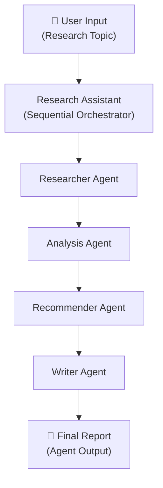

# Research Assistant Agent

A multi-agent research system built with **ADK-TS** that orchestrates specialized AI agents to conduct comprehensive research, analysis, and reporting on any topic.

This is the code demo for the 2-part article series on the IQ blog:

- [Part 1: Build a Research Assistant Agent in TypeScript with ADK-TS](http://blog.iqai.com/build-research-assistant-agent-typescript-adk-ts-part-1)
- [Part 2: Build a Research Assistant Agent in TypeScript with ADK-TS](http://blog.iqai.com/build-research-assistant-agent-typescript-adk-ts-part-2)

Please give this repo a ⭐ if it was helpful to you!

## Table of Contents

- [Overview](#overview)
- [Features](#features)
- [Architecture](#architecture)
- [Technologies Used](#technologies-used)
- [Prerequisites](#prerequisites)
- [Getting Started](#getting-started)
- [Usage](#usage)
- [License](#license)
- [Additional Resources](#additional-resources)

## Overview

The Research Assistant Agent demonstrates how to build a production-ready multi-agent system where specialized agents collaborate to accomplish complex tasks. Given any research topic, the system automatically:

1. **Researches** the topic from multiple angles
2. **Analyzes** findings to extract key insights
3. **Develops** actionable recommendations
4. **Compiles** a comprehensive final report

## Features

- **Multi-agent orchestration** with intelligent sequential processing
- **Specialized agents** for focused task execution:
  - **Researcher Agent** – Conducts targeted web searches (3-search methodology)
  - **Analysis Agent** – Extracts insights and identifies patterns
  - **Recommender Agent** – Develops actionable recommendations
  - **Writer Agent** – Synthesizes everything into a polished report
- **Web search integration** via Tavily for current, real-world data
- **Structured output** with clear sections and formatting
- **Type-safe implementation** with TypeScript

## Architecture



Each agent processes the output of the previous stage sequentially, creating a pipeline that transforms raw research into actionable insights and a professional report.

## Technologies Used

- **[ADK-TS](https://adk.iqai.com/)** – The TypeScript-Native AI Agent Framework
- **[ADK-TS CLI](https://adk.iqai.com/docs/cli)** – CLI for testing and running agents
- **TypeScript** – Type-safe agent development
- **[Google AI (Gemini)](https://aistudio.google.com/)** – LLM provider
- **[Tavily](https://tavily.com/)** – Real-time web search for data gathering

## Prerequisites

- Node.js 18+ and pnpm installed
- A [Google AI Studio](https://aistudio.google.com/api-keys) API key
- A [Tavily](https://app.tavily.com) API key

## Getting Started

1. Clone the repository:

   ```bash
   git clone https://github.com/IQAIcom/Research-Assistant-Agent.git
   cd Research-Assistant-Agent
   ```

2. Install dependencies:

   ```bash
   pnpm install
   ```

3. Set up environment variables:

   Create a `.env` file in the root directory:

   ```bash
   cp .env.example .env
   ```

   Add your API credentials:

   ```env
   # ADK-TS framework debug logs (optional)
   ADK_DEBUG=false

   # Google AI API key (required)
   GOOGLE_API_KEY=your_google_api_key_here

   # LLM model name (optional, defaults to gemini-2.5-flash)
   LLM_MODEL=gemini-2.5-flash

   # Tavily API key (required for web search)
   TAVILY_API_KEY=your_tavily_api_key_here
   ```

4. Test the agent with the [ADK-TS CLI](https://adk.iqai.com/docs/cli):

   The CLI auto-discovers your agents from the `src/agents` directory and lets you test without writing any additional code.

   **Terminal chat** — start an interactive chat session:

   ```bash
   npx @iqai/adk-cli run
   ```

   **Web interface** — launch a local web server with a visual chat UI:

   ```bash
   npx @iqai/adk-cli web
   ```

   Try sending a topic like "Impact of artificial intelligence on healthcare in 2025" and watch the pipeline execute each step.

   > The first run takes 30–60 seconds depending on your LLM and the topic complexity. Set `ADK_DEBUG=true` in your `.env` to see detailed logs of each agent's input, output, and state changes.

   Alternatively, you can run the agent directly with `pnpm dev`.

## Usage

The research assistant accepts any topic and produces a comprehensive report with:

- **Research Findings** – Synthesized data from web searches
- **Analysis** – Critical insights and identified patterns
- **Recommendations** – Actionable next steps and strategies
- **Final Report** – Professional document combining all elements

Example topics:

- "emerging trends in machine learning"
- "sustainable business practices"
- "remote work productivity strategies"
- "climate change impact on agriculture"

## License

This project is licensed under the MIT License – see the [LICENSE](LICENSE) file for details.

## Additional Resources

- 📝 [Part 1: Blog Article](http://blog.iqai.com/build-research-assistant-agent-typescript-adk-ts-part-1) – Building a multi-agent research assistant
- 📝 [Part 2: Blog Article](http://blog.iqai.com/build-research-assistant-agent-typescript-adk-ts-part-2) – Callbacks, session state, and memory
- 📚 [ADK-TS Documentation](https://adk.iqai.com/) – Full framework reference
- 🤖 [IQ AI](https://iqai.com/) – Agent development platform

### ADK-TS Resources

- 📖 [ADK-TS Documentation](https://adk.iqai.com/)
- 🖥️ [ADK-TS CLI Documentation](https://adk.iqai.com/docs/cli)
- 💻 [ADK-TS GitHub Repository](https://github.com/IQAICOM/adk-ts)
- 📋 [Explore ADK-TS Samples](https://github.com/IQAIcom/adk-ts-samples)
